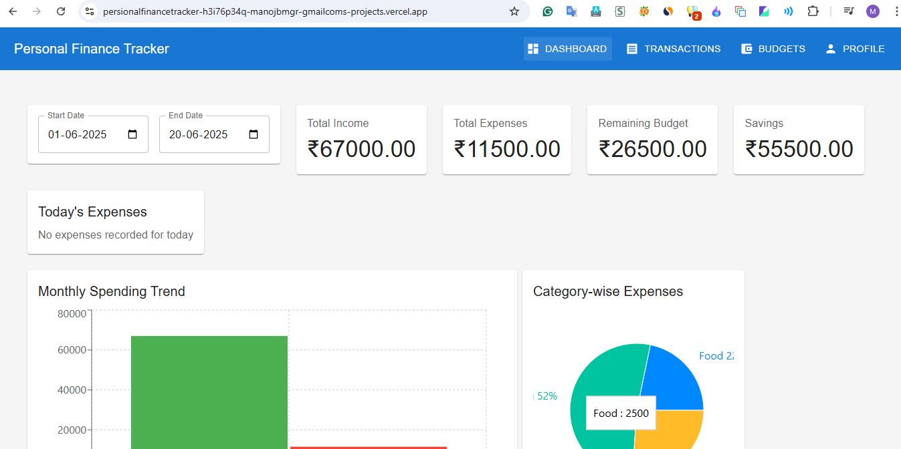

# Personal Finance Tracker
A React-based web application for tracking personal finances, built with Material-UI and modern React practices.
## Features
- Track income and expenses
- Visualize financial data with charts
- Responsive design for all devices
- Modern and intuitive user interface
- Real-time data updates
## Prerequisites
Before you begin, ensure you have the following installed:
- Node.js (v14.0.0 or higher)
- npm (v6.0.0 or higher)
## Installation
1. Clone the repository:
```bash
git clone https://github.com/manojbmgr/persionalfinancetracker
cd persionalfinancetracker
```
2. Install dependencies:
```bash
npm install
```
This will install all required dependencies including:
- React
- Material-UI (@mui/material)
- Material-UI Icons (@mui/icons-material)
- Emotion (@emotion/react, @emotion/styled)
- React Router DOM
- Recharts
- React Toastify
## Running the Application
1. Start the development server:
```bash
npm start
```
2. Open your browser and navigate to:
```
http://localhost:3000
```
## Project Structure
```
persionalfinancetracker/
├── public/
│   ├── index.html
│   └── ...
├── src/
│   ├── components/
│   │   ├── Header.js
│   │   ├── Dashboard.js
│   │   ├── TransactionForm.js
│   │   └── TransactionList.js
│   ├── App.js
│   ├── index.js
│   └── ...
├── package.json
└── README.md
```
## Dependencies
The main dependencies used in this project are:
```json
{
  "@emotion/react": "^11.14.0",
  "@emotion/styled": "^11.11.0",
  "@mui/material": "^7.1.1",
  "@mui/icons-material": "^5.0.0",
  "react": "^19.1.0",
  "react-dom": "^19.1.0",
  "react-router-dom": "^7.6.2",
  "react-scripts": "5.0.1",
  "react-toastify": "^11.0.5",
  "recharts": "^2.15.3"
}
```
## Available Scripts
In the project directory, you can run:
- `npm start` - Runs the app in development mode
- `npm test` - Launches the test runner
- `npm run build` - Builds the app for production
- `npm run eject` - Ejects from Create React App
## Contributing
1. Fork the repository
2. Create your feature branch (`git checkout -b feature/AmazingFeature`)
3. Commit your changes (`git commit -m 'Add some AmazingFeature'`)
4. Push to the branch (`git push origin feature/AmazingFeature`)
5. Open a Pull Request
## License
This project is licensed under the MIT License - see the LICENSE file for details.
## Acknowledgments
- Material-UI for the component library
- Create React App for the project setup
- Recharts for the charting capabilities
## Technical Documentation
### Project Architecture
The application follows a component-based architecture using React's modern features and best practices. Here's a detailed breakdown of the implementation:
### Core Components
#### 1. App.js
- **Purpose**: Main application component that sets up routing and global context
- **Key Features**:
  - Uses `BrowserRouter` for navigation
  - Implements `TransactionProvider` context for global state management
  - Handles routing between Dashboard and TransactionList components
#### 2. Components/Header.js
- **Purpose**: Navigation and app header component
- **Implementation Details**:
  - Uses Material-UI's `AppBar` and `Toolbar` components
  - Implements responsive navigation using `useNavigate` hook
  - Includes dynamic title updates based on current route
#### 3. Components/Dashboard.js
- **Purpose**: Main dashboard showing financial overview
- **Key Features**:
  - Uses `useContext` hook to access transaction data
  - Implements Recharts for data visualization
  - Calculates and displays:
    - Total balance
    - Income vs Expenses
    - Transaction history
  - Responsive design using Material-UI's Grid system
#### 4. Components/TransactionForm.js
- **Purpose**: Form for adding new transactions
- **Implementation Details**:
  - Uses controlled components with React state
  - Implements form validation
  - Uses `useContext` to access transaction context
  - Features:
    - Transaction type selection (Income/Expense)
    - Amount input with validation
    - Category selection
    - Date picker
    - Description field
#### 5. Components/TransactionList.js
- **Purpose**: Displays list of transactions
- **Key Features**:
  - Uses Material-UI's `Table` components
  - Implements sorting and filtering
  - Uses `useContext` for data access
  - Features:
    - Sortable columns
    - Filter by transaction type
    - Search functionality
    - Pagination
### State Management
#### TransactionContext
- **Location**: `src/context/TransactionContext.js`
- **Purpose**: Global state management for transactions
- **Implementation**:
  - Uses React's Context API
  - Implements `useReducer` for state management
  - Provides actions for:
    - Adding transactions
    - Deleting transactions
    - Updating transactions
    - Filtering transactions
### Custom Hooks
#### 1. useTransactions
- **Purpose**: Custom hook for transaction operations
- **Features**:
  - Transaction CRUD operations
  - Data filtering
  - Statistics calculation
  - Error handling
#### 2. useLocalStorage
- **Purpose**: Persists transaction data in localStorage
- **Implementation**:
  - Uses `useEffect` for data persistence
  - Handles data serialization/deserialization
  - Provides fallback for data loading
### Styling
- **Approach**: Uses Material-UI's styling solution
- **Implementation**:
  - Theme customization
  - Responsive design
  - Custom component styling
### Data Flow
1. **User Input** → TransactionForm
2. **Form Submission** → TransactionContext
3. **State Update** → All subscribed components
4. **Data Persistence** → LocalStorage
### Error Handling
- Form validation
- API error handling
- Data persistence error handling
- User feedback using React-Toastify
### Performance Optimizations
- Memoization using `useMemo` and `useCallback`
- Lazy loading of components
- Efficient re-rendering
- Optimized data structures
### Testing
- Component testing using Jest and React Testing Library
- Context testing
- Custom hooks testing
- Integration testing
### Screenshots
  
### Vercel URL
[https://persionalfinancetracker-h3i76p34q-manojbmgr-gmailcoms-projects.vercel.app/](https://persionalfinancetracker-h3i76p34q-manojbmgr-gmailcoms-projects.vercel.app/)